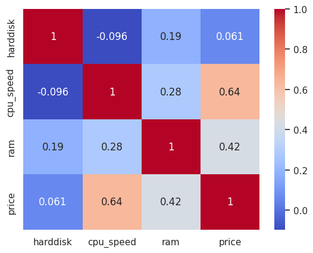

# پروژه اول درس داده کاوی


## Navid Mafi


# زمینه سازی

---

## وارد کردن ابزار ها و کتابخانه ها


```py
# importing libraries and tools

import pandas as pd
import numpy as np
import seaborn as sb
import matplotlib.pyplot as plt
import itertools
import re
```


## راه اندازی اولیه ابزار ها


در اینجا پالت رنگی کتابخانه Seaborn را مشخص کرده و آن را ست می کنیم.


```py
palette = sb.color_palette("bright",30)
palette_cmap = sb.color_palette("bright",as_cmap=True,as_cmap=True,n_colors=30)
sb.set(style="white")
sb.set_palette(palette)

print(plt.style.available)
plt.style.use("seaborn-v0_8-bright")
```


## خواندن فایل دیتا

در اینجا فایل CSV دیتا ها را بازخوانی می کنیم.


```py
# reading file

df = pd.read_csv("amazon_laptop_prices_v01.csv")
```


# پیش پردازش (Preprocessing)

---


## حذف داده های ناقص (Filtering: Validation)


بعضی از فیچر ها برای رسم نمودار ها حیاتی و لازم هستند. بنابراین لازم است دیتا ها را فیلتر کرده و دیتا هایی که فیچر های لازم را ندارند یا از فرمت بقیه داده ها پیروی نمی کنند، حذف کنیم.


```python
def filter_incomplete_data(row):
	# Filter out any entry that does not include all of the required columns  (Data cleanup)

	try:
    	# Check for valid numeric values in each column
    	return (
        	pd.notna(row["price"])
        	and pd.notna(row["cpu_speed"])
        	and pd.notna(row["ram"])
        	and pd.notna(row["screen_size"])
        	and pd.notna(row["harddisk"])
        	and bool(re.match(r"^\d+(\.\d+)? GHz$", str(row["cpu_speed"])))
        	and bool(  # Regex check for GHz format
            	re.match(r"^\d+(\.\d+)? GB$", str(row["ram"]))
        	)
    	)
	except Exception as e:
    	return False
    
    
    
    
df = df[df.apply(filter_incomplete_data, axis=1)]
```


## تبدیل فیچر های عددی به فرمت عددی مناسب


در این دیتا ست بعضی از فیچر ها مثل قیمت یا اندازه صفحه با پیشوند/پسوند همراه هستند. با استفاده از Regex این وند ها را حذف می کنیم.


```python
# normalize numerical data


# Extract numerical values
df["price"] = df["price"].replace("[\$,]", "", regex=True).astype(float)

# Extract CPU speed in GHz
df["cpu_speed"] = df["cpu_speed"].replace(" GHz", "", regex=True).astype(float)

# Extract RAM in GB
df["ram"] = df["ram"].replace(" GB", "", regex=True).astype(float)

# Extract screen size in inches
df["screen_size"] = df["screen_size"].replace(" Inches", "", regex=True).astype(float)

# Convert harddisk to GB (convert TB to GB)
df["harddisk"] = df["harddisk"].apply(
	lambda x: int(x.split()[0]) * 1000 if "TB" in x else int(x.split()[0])
)

# df['rating'] = df['rating'].astype(float)
```


## حذف داده های پرت (Filtering: Outlier Removal)


با استفاده از یک تابع بعنوان فیلتر داده های پرت را (مثل CPU با فرکانس 9000 گیگاهرتز یا 500 گیگابایت RAM) حذف میکنیم.


```python
def filter_outlier_data(row):
	# Filter out any entry that does not include all of the required columns  (Data cleanup)

	return (
    	row["price"] < 10_000
    	and row["cpu_speed"] < 9.00  # $10k max
    	and row["ram"] < 1024  # 9GHz cpu max
    	and row["screen_size"] < 20  # 20 inches max
    	and row["harddisk"] < 3_000  # 3TB storage max and
	)
    
    
    
    
df = df[df.apply(filter_outlier_data, axis=1)]
```


## آمار گیری : داده های تمیز و آماده آنالیز


تابع Shape ابعاد یک Dataframe را به ما می دهد. می بینیم که پس از حذف داده های پرت و ناقص حدود 1000 داده کارآمد باقی می ماند که اساس کار ما این داده ها خواهد بود.


```py
print(df.shape)
```


```py
(1020, 14)
```


تابع Describe کلاس Dataframe، هشت مشخصه اصلی سطر های داده (مثل میانه، میانگین، چارک ها و …) را به ما می دهد.


```py
print(df.describe())
```


```
      screen_size     harddisk          ram    cpu_speed      rating   
count  1020.000000  1020.000000  1020.000000  1020.000000  618.000000  \
mean     14.728922   810.576471    14.633333     1.480637    4.573301   
std       0.928914   414.454323     7.864085     0.849692    0.503295   
min      11.600000     8.000000     2.000000     0.900000    1.000000   
25%      14.000000   512.000000     8.000000     1.100000    4.400000   
50%      14.000000  1000.000000    16.000000     1.100000    4.700000   
75%      15.600000  1000.000000    16.000000     1.200000    5.000000   
max      17.300000  2000.000000    64.000000     5.600000    5.000000   

             price  
count  1020.000000  
mean    650.563804  
std     546.032298  
min      99.990000  
25%     389.990000  
50%     459.990000  
75%     589.990000  
max    5599.000000  

```


با استفاده از تابع Head می توانیم 5 ورودی اول دیتای فیلتر شده مان را مشاهده کنیم


```py
df.head(5)
```


## اکسترکت کردن دیتا


همچنین از تابع tolist استفاده میکنیم تا دیتافریم های Pandas را به دیتا تایپ بومی لیست پایتون تبدیل کنیم تا بتوانیم عملیات های حلقوی را روی آنها انجام دهیم.


```py
brands = df["brand"].tolist()
models = df["model"].tolist()
screen_sizes = df["screen_size"].tolist()
colors = df["color"].tolist()
harddisks = df["harddisk"].tolist()
cpus = df["cpu"].tolist()
rams = df["ram"].tolist()
OSs = df["OS"].tolist()
special_features = df["special_features"].tolist()
graphics = df["graphics"].tolist()
graphics_coprocessors = df["graphics_coprocessor"].tolist()
cpu_speeds = df["cpu_speed"].tolist()
ratings = df["rating"].tolist()
# price = df['price'].tolist()
# price = pd.to_numeric(df['price'], errors='coerce').tolist()
prices = df["price"].tolist()
# price = df['price'].replace('[\$,]', '', regex=True).astype(float)
# price = df['price'].str[1:].tolist()
```


## مشخص کردن داده های عددی و اسمی


```py
numerical_cols_names = ["price", "ram", "harddisk", "cpu_speed", "screen_size"]
numerical_cols_data = [prices, rams, harddisks, cpu_speeds, screen_sizes]

nominal_col_names = ["brand","color","OS","graphics"]
nominal_col_datas = [brands,colors,OSs,graphics]
```


# پردازش و رسم نمودار (Analysis)

---


## رسم باکس پلات


باکس پلات ها نمودار های خوبی برای ارائه دید کلی به داده های <strong>یک بعد</strong> هستند.


```py
fig, axes = plt.subplots(1, 3, figsize=(15, 5))


sb.boxplot(x=prices, ax=axes[0], color=palette[1])
axes[0].set_title('Boxplot for Prices')


sb.boxplot(x=screen_sizes, ax=axes[1], color=palette[2])
axes[1].set_title('Boxplot for Screen Sizes')

sb.boxplot(x=ratings, ax=axes[2], color=palette[3])
axes[2].set_title('Boxplot for Reviews')
```


## رسم هیستوگرام ها


رسم هیستوگرام برای فیچر های قیمت، اندازه صفحه، مقدار رم، رنگ بندی و مقدار هارد یک دید کلی در مورد فراوانی محصولات با مقادیر مختلف این ویژگی ها می دهد.


```py
fig, axes = plt.subplots(3, 2, figsize=(15, 15))
# plt.tight_layout()
# Prices histogram
ax = axes[0, 0]
ax.hist(prices, bins=10, color=palette[3])
ax.set_title("Prices Histogram")
ax.set_xlabel("Price")
ax.set_ylabel("Frequency")
ax.set_xticks(np.arange(min(prices), max(prices), 500))


# Screen sizes histogram
ax = axes[0, 1]
ax.hist(screen_sizes, bins=10, color=palette[4])
ax.set_title("Screens Histogram")
ax.set_xlabel("Screen size")
ax.set_ylabel("Frequency")


# CPU Speed histogram
ax = axes[1, 0]
ax.hist(cpu_speeds, bins=10, color=palette[5])
ax.set_title("CPU Speed Histogram")
ax.set_xlabel("CPU Speed")
ax.set_ylabel("Frequency")
ax.set_xticks(np.arange(min(cpu_speeds), max(cpu_speeds), 0.5))


# RAM histogram
ax = axes[1, 1]
ax.hist(rams, bins=10, color=palette[6])
ax.set_title("RAM Histogram")
ax.set_xlabel("RAM")
ax.set_ylabel("Frequency")
ax.set_xticks(np.arange(min(rams), max(rams), 4))


# Color histogram

colors_series = pd.Series(colors)
color_counts = colors_series.value_counts()
popular_colors = colors_series[colors_series.isin(color_counts.index[color_counts > 5])]

print(popular_colors.value_counts())
ax = axes[2, 0]
ax.hist(popular_colors, bins=10, color=palette[7])
ax.set_title("Color Histogram")
ax.set_xlabel("Color")
ax.set_ylabel("Frequency")


# Disk histogram
ax = axes[2, 1]
ax.hist(harddisks, bins=10, color=palette[8])
ax.set_title("Disk Histogram")
ax.set_xlabel("Disk")
ax.set_ylabel("Frequency")
ax.set_xticks(np.arange(0, max(harddisks), 256))


plt.subplots_adjust(wspace=0.2, hspace=0.4)

# print(min(cpu_speeds), max(cpu_speeds))
# ax.set_xticks(np.arange(min(cpu_speeds), max(cpu_speeds), 10))
```


## رسم Scatter Plot ها


بعد از تبدیل ابعاد عددی به دیتا تایپ مناسب در پایتون می توانیم یک حلقه ساخته و در آن از تابع scatter استفاده کنیم تا اسکاتر پلات های جفت مرتب فیچر های مختلف را بسازیم. در اینجا 4 فیچر عددی برگزیده شده و اسکاتر پلات آن ها رسم شده است.</p>


در این حلقه ابتدا i را با j مقایسه کرده و اگر مساوی نبودند، اسکاتر پلات می کشیم. در صورت تساوی آنها (که یعنی هر دو یک فچیر هستند) هیستوگرام آن فیچر را رسم می کنیم.


```py
cols = ['Storage','CPU speeds','RAM','Price']
data = [harddisks,cpu_speeds,rams,prices]


fig, axes = plt.subplots(len(cols), len(data), figsize=(12, 12))

for i, j in itertools.product(range(len(cols)), repeat=2):
	ax = axes[i,j]
	# Scatter plot if i and j are not equal
	if i != j:
    	ax.scatter(data[j], data[i], color=palette[i+j])
    	ax.set_title(f'{cols[i]} and {cols[j]}')
    	ax.set_xlabel(cols[j])
    	ax.set_ylabel(cols[i])
   
	# Hist plot if i and j are equal
	else:
    	ax.hist(data[i], bins=10, color=palette[1])
    	ax.set_title(f'{cols[i]}')
    	ax.set_xlabel(cols[i])
    	ax.set_ylabel('Frequency')

plt.tight_layout()
```


## رسم ماتریس اسکاتر پلات:


ماتریس اسکاتر پلات را برای 4 مشخصه برگزیده می سازیم. نمودار حاصل به جز تفاوت های جزئی در نمایش شبیه نمودار بزرگ ساخته شده شکل قبلی است.


```py
cols = ['harddisk','cpu_speed','ram','price']

sb.pairplot(df[cols])
plt.suptitle('Scatter Plot Matrix', y=1.02)
```


## رسم Pairplot


نمودار Pairplot یک نمودار ماتریسی است که می توان از آن بر روی داده های Nominal استفاده کرده و یک داده را به عنوان Hue انتخاب کرد تا خروجی آن یک ماتریس نمودار با ابعاد dim Nominal cols به توان 2 باشد. هر ماتریس یک Scatter plot سه بعدی است که بعد سوم که Hue باشد با رنگ مشخص شده است.


```py
sb.pairplot(df, hue="brand", palette=palette)
```


## رسم هیستوگرام دو بعدی


همانطور که از اسمشان پیداست، هیستوگرام های دو بعدی بر خلاف هیستوگرام های تک بعدی، به جای نشان دادن فراوانی یک فیچر بصورت مساحت زیر نمودار، فراوانی دو فیچر نسبت به هم را در قالب پررنگ/کمرنگ بودن آن خانه نشان می دهد.


```py
# Create a 2D Histplot
fig, axes = plt.subplots(1,3, figsize=(15, 5))


ax = axes[0]
sb.histplot(x=rams,y=prices, ax=ax, bins=10)
plt.title("Ram and Prices 2D Histogram")


ax = axes[1]
sb.histplot(x=screen_sizes,y=prices, ax=ax, bins=10)
plt.title("Screen sizes and Prices 2D Histogram")


ax = axes[2]
sb.histplot(x=harddisks,y=prices, ax=ax, bins=10)
plt.title("Storage and Prices 2D Histogram")
```


```py
def filter_brands_by_sales(dataframe, threshold=50):
	brand_counts = dataframe['brand'].value_counts()
	popular_brands = brand_counts[brand_counts > threshold].index
	filtered_df = dataframe[dataframe['brand'].isin(popular_brands)]
	return filtered_df
```


```py
fig, axes = plt.subplots(1,1, figsize=(20, 5))

popular_brands_df = filter_brands_by_sales(df, threshold=2)

ax = axes
sb.histplot(x=popular_brands_df['brand'],y=popular_brands_df['price'], ax=ax, bins=10)
plt.title("Popular Brands and Prices 2D Histogram")
plt.xlabel("Brand")
plt.ylabel("Price")
```


## رسم هیت مپ


هیت مپ یک نمایش گرافیکی از داده ها با استفاده از رنگ ها برای تجسم مقادیر ماتریس است. در این مورد، برای نشان دادن مقادیر با فراوانی بیشتر،از رنگ های مایل به قرمز و برای نشان دادن مقادیر کمتر، از های تیره تر مایل به آبی استفاده می شود.


```py
cols = ['harddisk','cpu_speed','ram','price']

corr_matrix = df[cols].corr()

# Create a heatmap
sb.heatmap(corr_matrix, annot=True, cmap="coolwarm")
```




